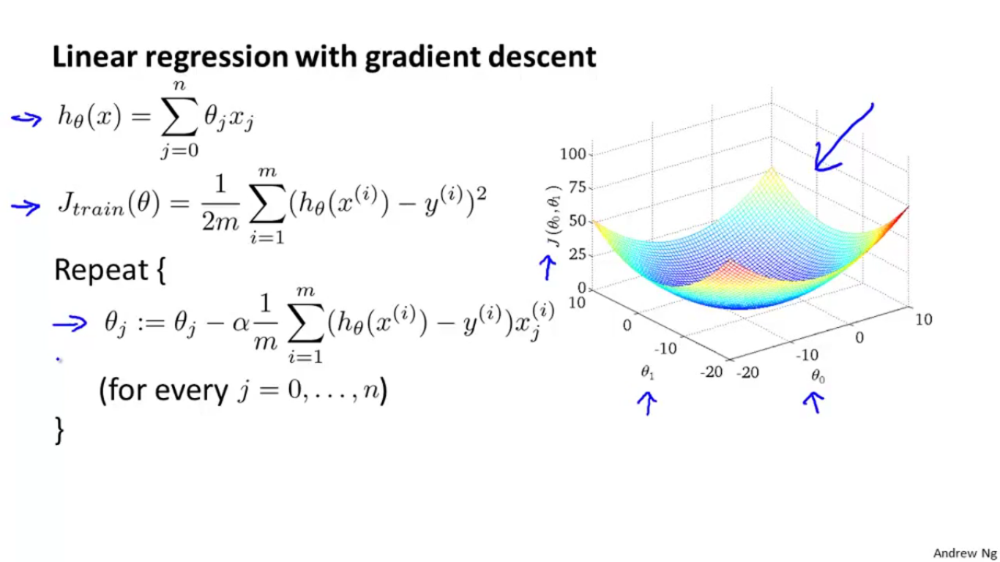

## Learning with Large Datasets

We mainly benefit from a very large dataset when our algorithm has high variance when m is small. Recall that if our algorithm has high bias, more data will not have any benefit.

Datasets can often approach such sizes as m = 100,000,000. In this case, our gradient descent step will have to make a summation over all one hundred million examples. We will want to try to avoid this -- the approaches for doing so are described below.

## Stochastic Gradient Descent

For many learning algorithms, among them linear regression, logistic regression and neural networks,the way we derive the algorithm was by coming up with a cost function or coming up with an optimization objective. And then using an algorithm like gradient descent to minimize that cost function. We have a very large training set gradient descent becomes a computationally very expensive procedure.

we'll talk about a modification to the basic gradient descent algorithm called Stochastic gradient descent, which will allow us to scale these algorithms to much bigger training sets.

Suppose you are training a linear regression model using gradient descent.

So below a picture of what gradient descent does, if the parameters are initialized to the point there then as you run gradient descent different iterations of gradient descent will take the parameters to the global minimum.

This algorithm will only try to fit one training example at a time. This way we can make progress in gradient descent without having to scan all m training examples first. Stochastic gradient descent will be unlikely to converge at the global minimum and will instead wander around it randomly, but usually yields a result that is close enough. Stochastic gradient descent will usually take 1-10 passes through your data set to get near the global minimum

## Mini-Batch Gradient Descent

Mini-batch gradient descent can sometimes be even faster than stochastic gradient descent. Instead of using all m examples as in batch gradient descent, and instead of using only 1 example as in stochastic gradient descent, we will use some in-between number of examples b.

Typical values for b range from 2-100 or so.

The advantage of computing more than one example at a time is that we can use vectorized implementations over the b examples.

## Stochastic Gradient Descent Convergence

How do we choose the learning rate α for stochastic gradient descent? Also, how do we debug stochastic gradient descent to make sure it is getting as close as possible to the global optimum?

One strategy is to plot the average cost of the hypothesis applied to every 1000 or so training examples. We can compute and save these costs during the gradient descent iterations.

With a smaller learning rate, it is possible that you may get a slightly better solution with stochastic gradient descent. That is because stochastic gradient descent will oscillate and jump around the global minimum, and it will make smaller random jumps with a smaller learning rate.

If you increase the number of examples you average over to plot the performance of your algorithm, the plot's line will become smoother.

With a very small number of examples for the average, the line will be too noisy and it will be difficult to find the trend.

## Online learning
With a continuous stream of users to a website, we can run an endless loop that gets (x,y), where we collect some user actions for the features in x to predict some behavior y.

You can update θ for each individual (x,y) pair as you collect them. This way, you can adapt to new pools of users, since you are continuously updating theta.

## Map-Reduce and Parallelism

We can divide up batch gradient descent and dispatch the cost function for a subset of the data to many different machines so that we can train our algorithm in parallel.

Your learning algorithm is MapReduceable if it can be expressed as computing sums of functions over the training set. Linear regression and logistic regression are easily parallelizable.

For neural networks, you can compute forward propagation and back propagation on subsets of your data on many machines. Those machines can report their derivatives back to a 'master' server that will combine them.
