# Photo OCR

The following question can be answered after studying following contents.

1. How a complex machine learning system can be put together i.e Pipeline.

2. Knowing the pipeline concepts how can we allocate resources when you're trying to decide what to do next.

**NOTE**
A machine learning pipeline is a system with many stages/components, several of which may use machine learning.

A simple machine learning pipeline to solve Photo OCR (Photo Optical Character Recognition.) is:
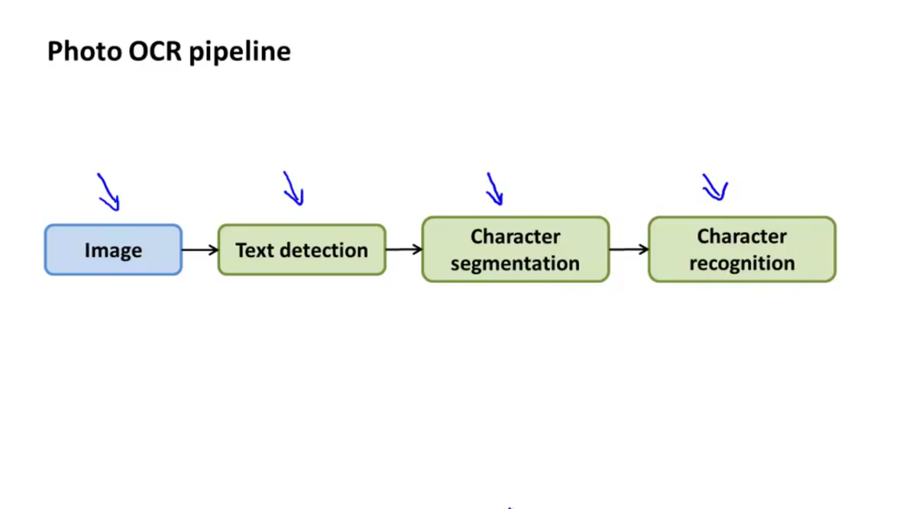
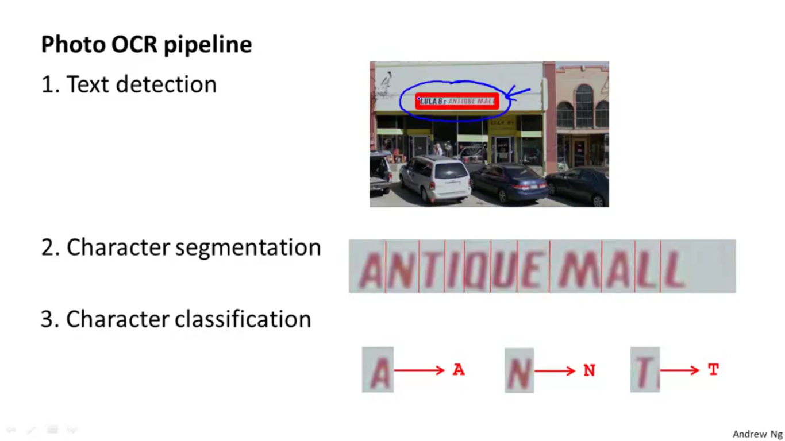

One of the most reliable ways to get a high performance machine learning system is to take a low bias learning algorithm and to train it on a massive training set. Artificial data synthesis can help us on collecting such massive training set.

# Artificial data synthesis for Photo OCR
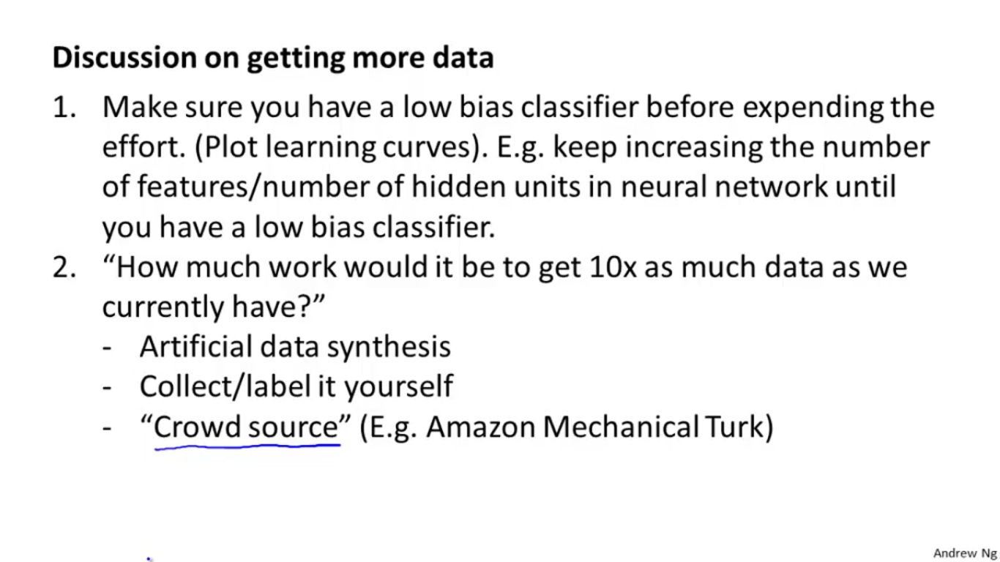

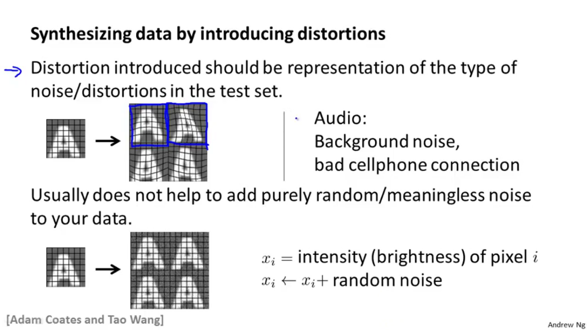
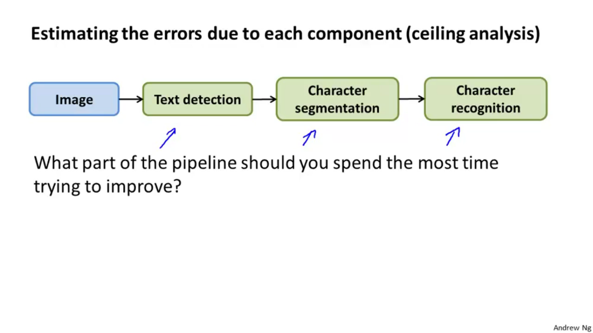
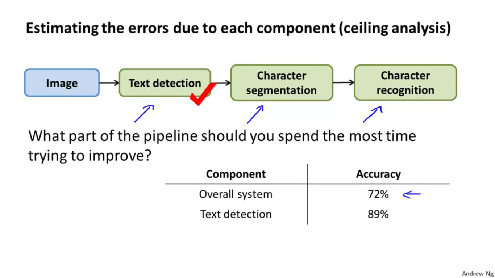
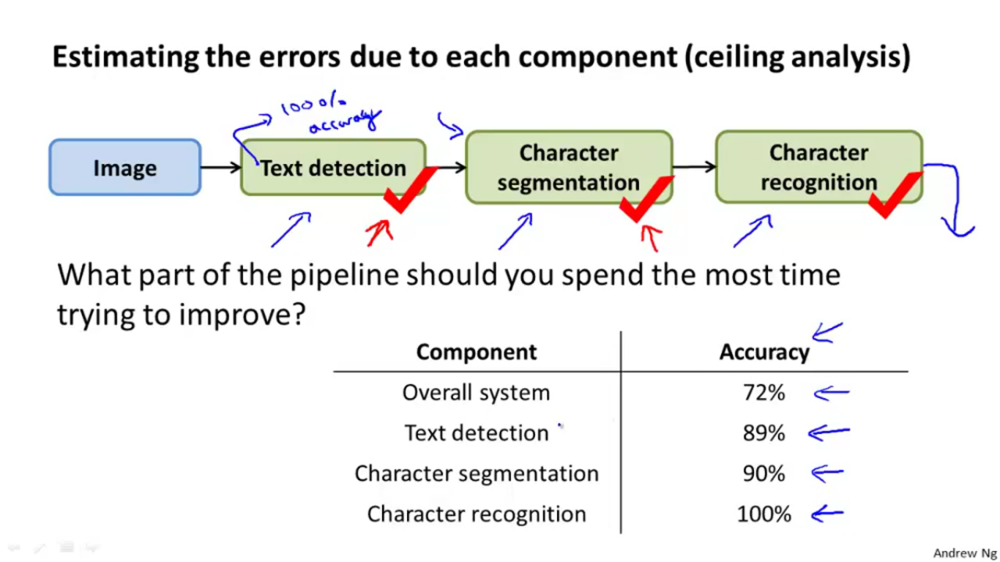
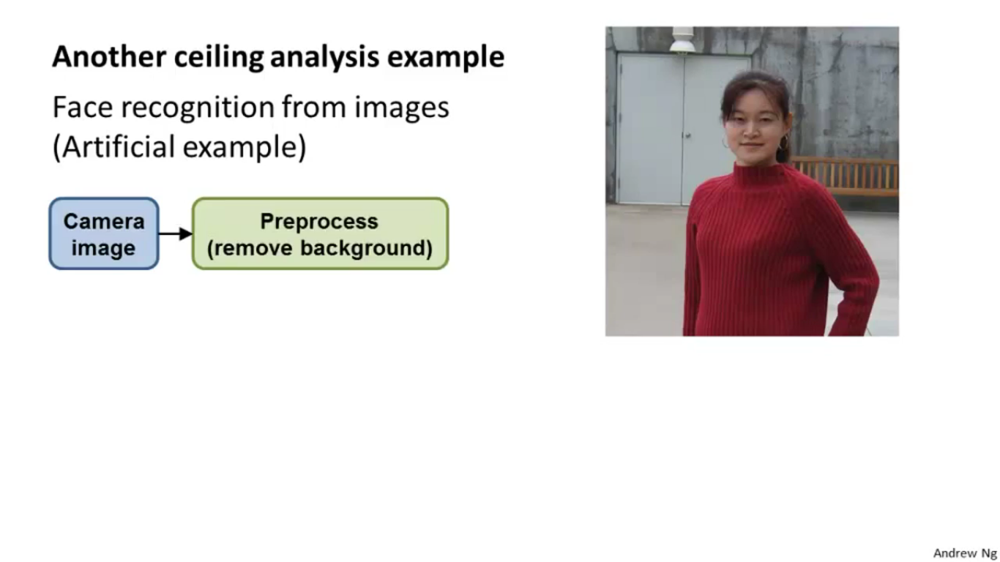
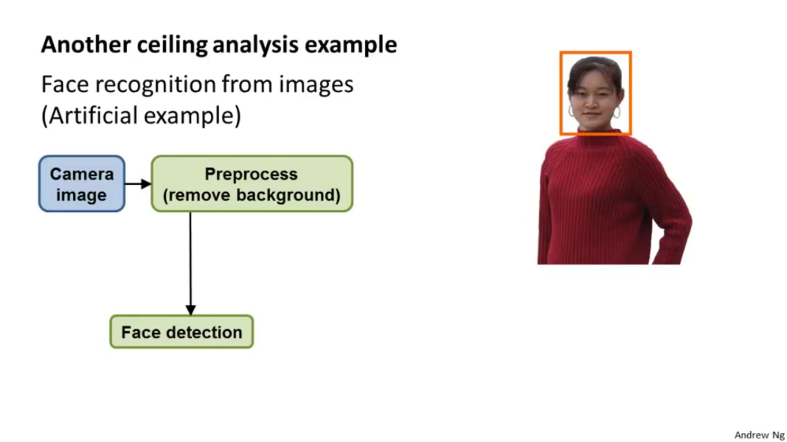
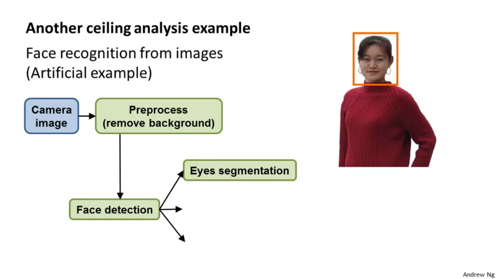
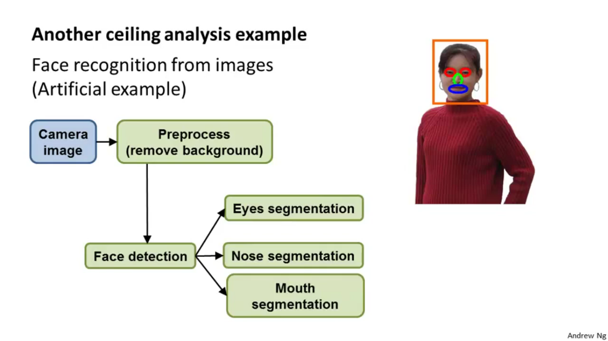

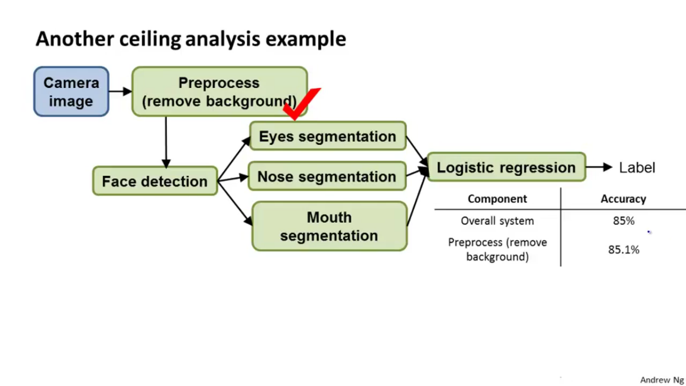
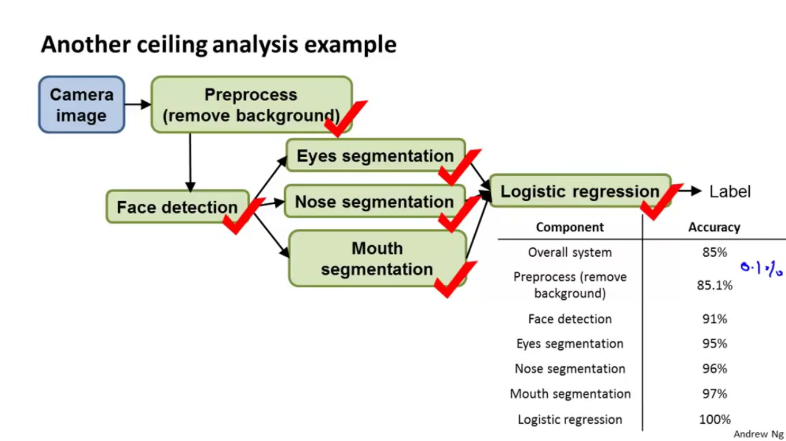
