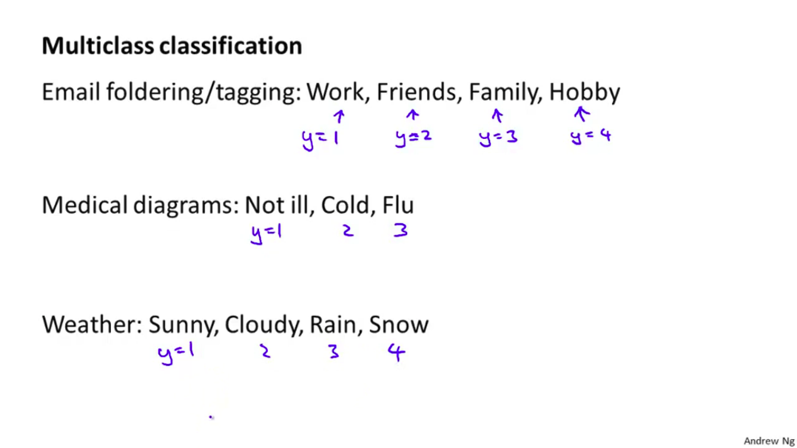
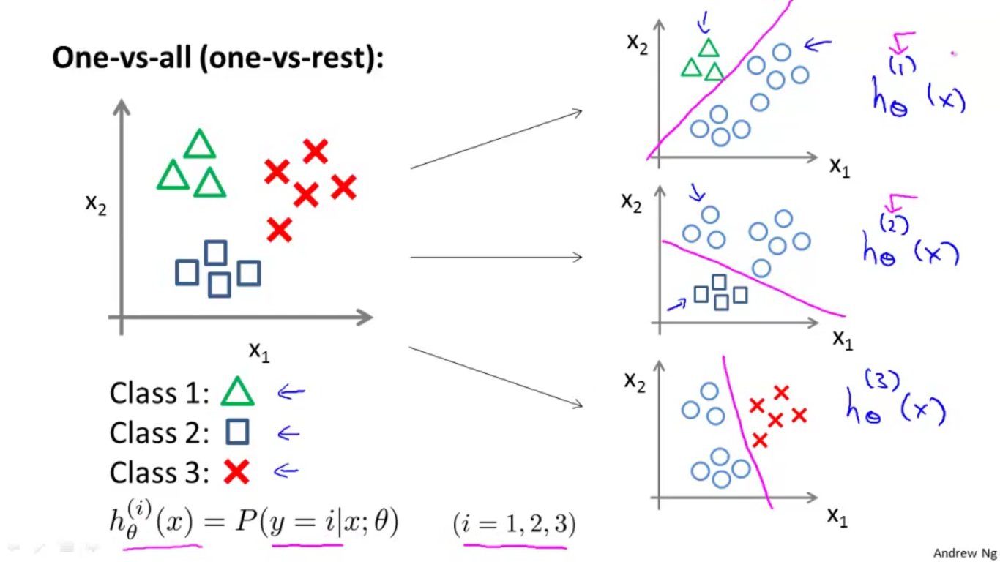

### Classification
To attempt classification, one method is to use linear regression and map all predictions greater than 0.5 as a 1 and all less than 0.5 as a 0. However, this method doesn't work well because classification is not actually a linear function.

The classification problem is just like the regression problem, except that the values we now want to predict take on only a small number of discrete values. For now, we will focus on the binary classification problem in which y can take on only two values, 0 and 1. (Most of what we say here will also generalize to the multiple-class case.) For instance, if we are trying to build a spam classifier for email, then x(i) may be some features of a piece of email, and y may be 1 if it is a piece of spam mail, and 0 otherwise. Hence, y∈{0,1}. 0 is also called the negative class, and 1 the positive class, and they are sometimes also denoted by the symbols “-” and “+.” Given x(i), the corresponding y(i) is also called the label for the training example.

### Hypothesis Representation
We could approach the classification problem ignoring the fact that y is discrete-valued, and use our old linear regression algorithm to try to predict y given x. However, it is easy to construct examples where this method performs very poorly. Intuitively, it also doesn’t make sense for hθ(x) to take values larger than 1 or smaller than 0 when we know that y ∈ {0, 1}. To fix  this, let’s change the form for our hypotheses hθ(x) to satisfy 0≤hθ(x)≤1. This is accomplished by plugging θTx into the Logistic Function.

Our new form uses the "Sigmoid Function," also called the "Logistic Function":

The following image shows us what the sigmoid function looks like:

The function g(z), shown here, maps any real number to the (0, 1) interval, making it useful for transforming an arbitrary-valued function into a function better suited for classification.

hθ(x) will give us the probability that our output is 1. For example, hθ(x)=0.7 gives us a probability of 70% that our output is 1. Our probability that our prediction is 0 is just the complement of our probability that it is 1 (e.g. if probability that it is 1 is 70%, then the probability that it is 0 is 30%).

### Gist of Logistic regression

### Decision Boundary
To understand what our Logistic regression is computing, we have to understand decision boundary. For Linear Hypothesis function, we get linear decision boundary. But for polynomial Hypothesis function, we get non-linear decision boundary.

When we have higher degree polynomial Hypothesis function, we get more complex decision boundary.As We can see it in the lower image.

### NOTE
Decision boundary is a property of hypothesis and it's parameters vector theta, and not of the training set.

The training set may be used to fit the parameters theta but it doesn't set decision boundary. And once we have the parameters theta we can defines the decisions boundary.

## Logistic regression Learning Model

The goal of logistic regression is to find the best fitting model to describe the relationship between the dependent variable and a set of independent variables.

When we talk about model, we need a cost function. But in logistic regression we cannot use the same cost function that we used for linear regression because of the wavy nature of sigmoid function. sigmoid function causes many local optima or cost function will be non-convex function.

So, Our cost function of logistic regression looks like:

Let us talk about cost function when y = 1 and when y=0.

If our correct answer 'y' is 0, then the cost function will be 0 if our hypothesis function also outputs 0. If our hypothesis approaches 1, then the cost function will approach infinity.

If our correct answer 'y' is 1, then the cost function will be 0 if our hypothesis function outputs 1. If our hypothesis approaches 0, then the cost function will approach infinity.

**Note** that writing the cost function in this way guarantees that J(θ) is convex for logistic regression.

# Gradient Descent for Logistic regression

## Advance optimization

# Multiclass classification

Let us talk about how to get logistic regression to work for multiclass classification problems.

Here are some example of multiclass classification problems with class y = {1,2,3,4} or y = {1,2,3}

Till now we have just build our training model to classify binary problems. So
**How do we get a learning algorithm to work for the multiclass classification problems?**

We already know how to do binary classification using a regression. And how to make decision boundary to classify positive and negative classes. Hence, we will take help of same method with another approach which is known by **one-vs-all classification or one-vs-rest classification**.

**NOTE**
 1. Using one-vs-all method, In a multiclass classification problem with **K** classes we end up training with **K** different classifiers.
 2. In one-vs-all method, we are basically picking up the classifier that gives highest accuracy rate of prediction.
