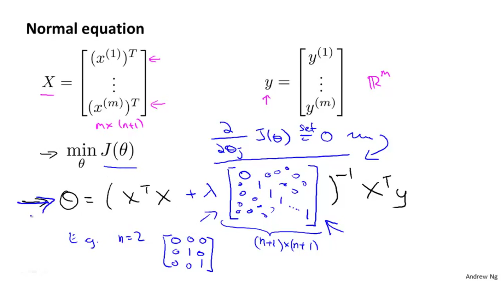

# The Problem of overfitting.
Just likes bugs in software causes poor performance of system similarly Overfitting and underfitting are some monsters of machine learning problems that results in poor performance of learning models of machine Learning.

It is necessary that our models function fit properly to approximate the results of target function.

**Overfitting**:
Overfitting happens when a model learns the detail and noise in the training data to the extent that it negatively impacts the performance of the model on new data. On other words, models with overfitting problem has good performance on the training data, poor generliazation to other data. It is usually caused by a complicated function that creates a lot of unnecessary curves and angles unrelated to the data.

**Underfitting**:
Underfitting refers to a model that can neither model the training data nor generalize to new data. It is usually caused by a function that is too simple or uses too few features.

Some important techniques that we can use when evaluating machine learning algorithms to limit overfitting are:

1. Reduce the number of features:
    1. Manually select which features to keep.
    2. Use a model selection algorithm such as a resampling technique.
       1. The most popular resampling technique is k-fold cross validation.
2. Regularization
    1. Keep all the features, but reduce the magnitude of parameters θj.
    2. Regularization works well when we have a lot of slightly useful features.
3. Hold back a validation dataset.
   1. A validation dataset is simply a subset of your training data that you hold back from your machine learning algorithms until the very end of your project. After you have selected and tuned your machine learning algorithms on your training dataset you can evaluate the learned models on the validation dataset to get a final objective idea of how the models might perform on unseen data.

## Regularization
If we have overfitting from our hypothesis function, we can reduce the weight that some of the terms in our function carry by increasing their cost.

Say we wanted to make the following function more quadratic:

θ0 + θ1x+ θ2x2+θ3x3+θ4x4   

We'll want to eliminate the influence of θ3x3 and θ4x4 . Without actually getting rid of these features or changing the form of our hypothesis, we can instead modify our **cost function**:

We've added two extra terms at the end to inflate the cost of θ3 and θ4. Now, in order for the cost function to get close to zero, we will have to reduce the values of θ3 and θ4 to near zero. This will in turn greatly reduce the values of θ3x3 and θ4x4 in our hypothesis function. As a result, we see that the new hypothesis (depicted by the pink curve) looks like a quadratic function but fits the data better due to the extra small terms θ3x3 and θ4x4

The λ, or lambda, is the regularization parameter. It determines how much the costs of our theta parameters are inflated.

Functions of Lambda is to controls the trade of between two goals:
   1. The goal of fitting the training set well.
   2. The goal of keeping the parameter small ant therefore keeping the hypothesis relatively simple  to avoid overfitting

Using the above cost function with the extra summation, we can smooth the output of our hypothesis function to reduce overfitting. If lambda is chosen to be too large, it may smooth out the function too much and cause underfitting. Hence, what would happen if λ=0 or is too small ? Result as overfitting problem not solved.

We can apply regularization to both linear regression and logistic regression. We will approach linear regression first.

## Regularization for linear Regression
For linear regression, we have previously worked out two learning algorithms. One based on gradient descent and one based on the normal equation.

### Normal equation
Now let's approach regularization using the alternate method of the non-iterative normal equation.

To add in regularization, the equation is the same as our original, except that we add another term inside the parentheses:

