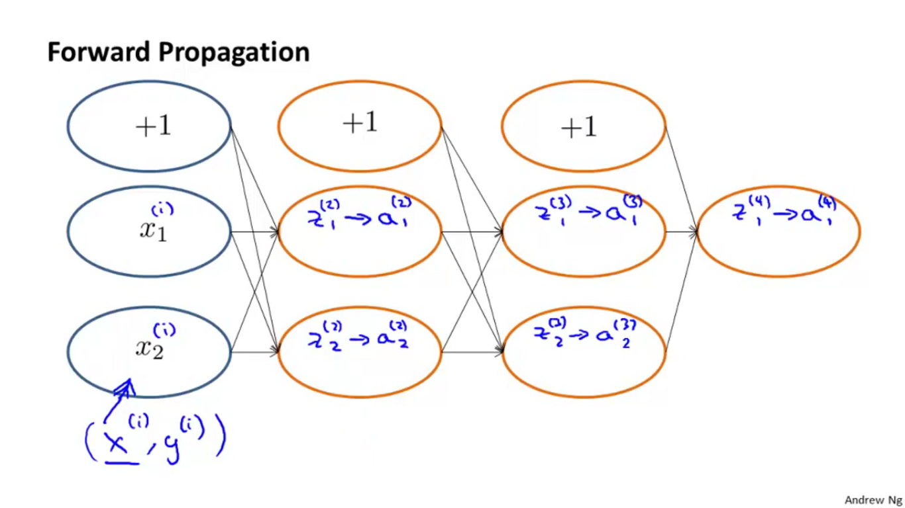
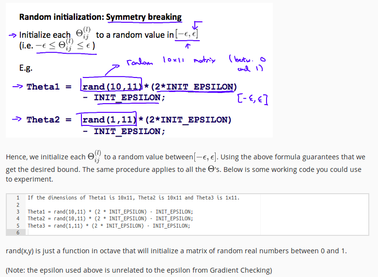

# Neural Network
Let us talk about a learning algorithm for fitting the parameters of a neural network given a training set.

## Cost Function
Let's first define a few variables that we will need to use:

    * L = total number of layers in the network
    * sl = number of units (not counting bias unit) in layer l
    * K = number of output units/classes

Recall that in neural networks, we may have many output nodes. We denote hΘ(x)k as being a hypothesis that results in the kth output. Our cost function for neural networks is going to be a generalization of the one we used for logistic regression. Recall that the cost function for regularized logistic regression was:

We have added a few nested summations to account for our multiple output nodes. In the first part of the equation, before the square brackets, we have an additional nested summation that loops through the number of output nodes.

In the regularization part, after the square brackets, we must account for multiple theta matrices. The number of columns in our current theta matrix is equal to the number of nodes in our current layer (including the bias unit). The number of rows in our current theta matrix is equal to the number of nodes in the next layer (excluding the bias unit). As before with logistic regression, we square every term.

Note:

  *  the double sum simply adds up the logistic regression costs calculated for each cell in the output layer
  *  the triple sum simply adds up the squares of all the individual Θs in the entire network.
  *  the i in the triple sum does not refer to training example i

## Backpropagation Algorithm
"Backpropagation" is neural-network terminology for minimizing our cost function, just like what we were doing with gradient descent in logistic and linear regression. Our goal is to compute:

minΘJ(Θ)

That is, we want to minimize our cost function J using an optimal set of parameters in theta. In this section we'll look at the equations we use to compute the partial derivative of J(Θ):

What is Back Propagation Doing?

Let us get better intuition of feed-forward and Back Propagation

## Gradient checking to remove implementation Bugs

Gradient checking helps in bug free implementation of back Propagation.

When you're running an algorithm of gradient descent, or the advanced optimization algorithms, we need to pick some initial value for the parameters theta. So for the advanced optimization algorithm, it assumes you will pass it some initial value for the parameters theta.

## Random Initialization

Initializing all theta weights to zero does not work with neural networks. When we backpropagate, all nodes will update to the same value repeatedly. Instead we can randomly initialize our weights for our matrices using the following method:

First, pick a network architecture; choose the layout of your neural network, including how many hidden units in each layer and how many layers in total you want to have.

    * Number of input units = dimension of features
    * Number of output units = number of classes
    * Number of hidden units per layer = usually more the better (must balance with cost of computation as it increases with more hidden units)
    * Defaults: 1 hidden layer. If you have more than 1 hidden layer, then it is recommended that you have the same number of units in every hidden layer.

### Training a Neural Network

