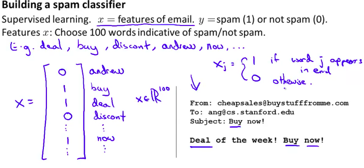
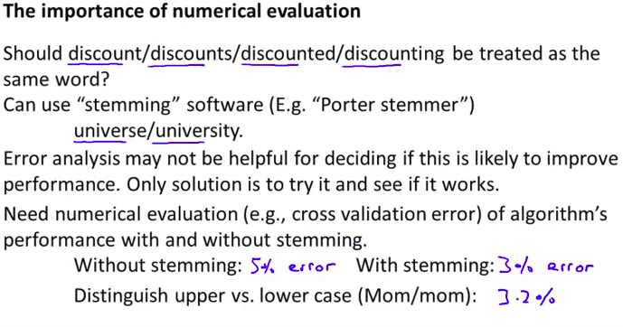
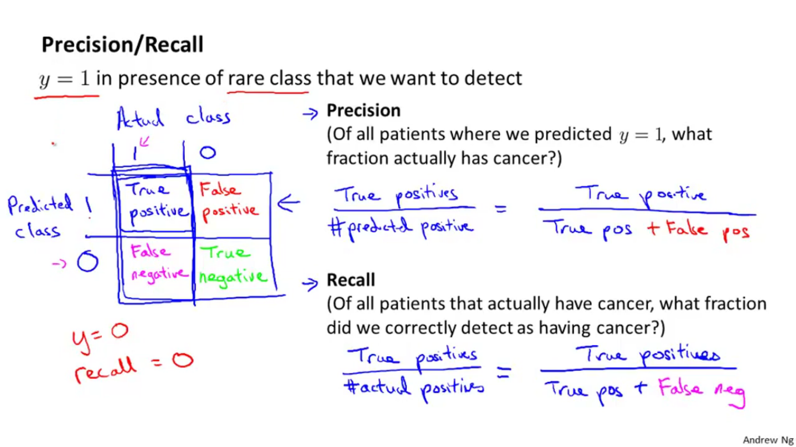
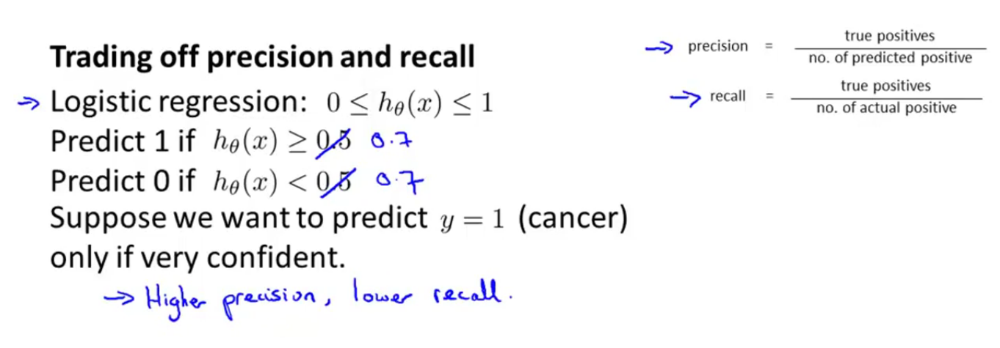
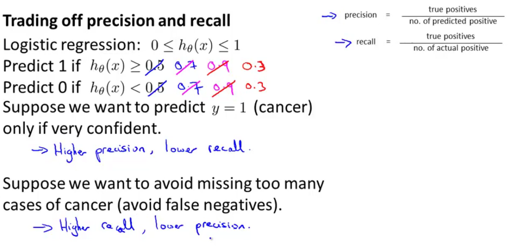
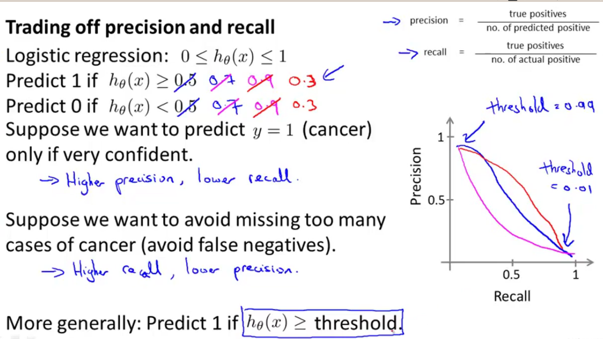
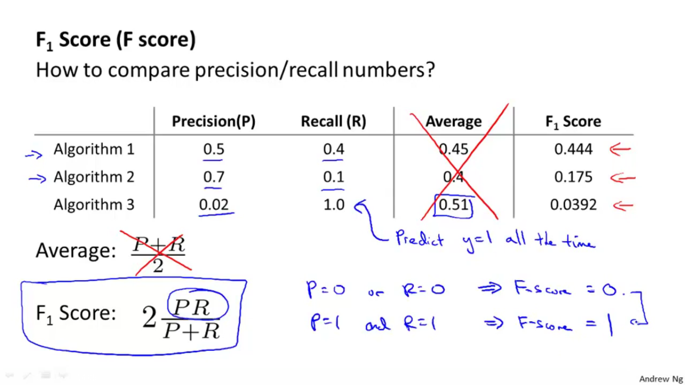

# Evaluating a Learing Akgorithm

Once we have done some trouble shooting for errors in our predictions by:

    * Getting more training examples
    * Trying smaller sets of features
    * Trying additional features
    * Trying polynomial features
    * Increasing or decreasing λ

We can move on to evaluate our new hypothesis.

A hypothesis may have a low error for the training examples but still be inaccurate (because of overfitting). Thus, to evaluate a hypothesis, given a dataset of training examples, we can split up the data into two sets: a training set and a test set. Typically, the training set consists of 70 % of your data and the test set is the remaining 30 %.

# Model Selection and Train/Validation/Test Sets

Just because a learning algorithm fits a training set well, that does not mean it is a good hypothesis. It could over fit and as a result your predictions on the test set would be poor. The error of your hypothesis as measured on the data set with which you trained the parameters will be lower than the error on any other data set.

Given many models with different polynomial degrees, we can use a systematic approach to identify the 'best' function. In order to choose the model of your hypothesis, you can test each degree of polynomial and look at the error result.

One way to break down our dataset into the three sets is:

  *  Training set: 60%
  *  Cross validation set: 20%
  *  Test set: 20%

We can now calculate three separate error values for the three different sets using the following method:

  1.  Optimize the parameters in Θ using the training set for each polynomial degree.
  1.  Find the polynomial degree d with the least error using the cross validation set.
  1.  Estimate the generalization error using the test set with JtestΘ<(d), (d = theta from polynomial with lower error);

This way, the degree of the polynomial d has not been trained using the test set.

# BIAS vs Variance

n this section we examine the relationship between the degree of the polynomial d and the underfitting or overfitting of our hypothesis.

  *  We need to distinguish whether bias or variance is the problem contributing to bad predictions.
  *  High bias is underfitting and high variance is overfitting. Ideally, we need to find a golden mean between these two.

The training error will tend to **decrease** as we increase the degree d of the polynomial.

At the same time, the cross validation error will tend to **decrease** as we increase d up to a point, and then it will increase as d is **increased**, forming a convex curve.
[bias-vs-variance](pics/evaluation/bias-vs-variance.png)

# Regularization and Bias/Variance

# Building a Spam Classifier

## Prioritizing What to Work On
### System Design Example:
Given a data set of emails, we could construct a vector for each email. Each entry in this vector represents a word. The vector normally contains 10,000 to 50,000 entries gathered by finding the most frequently used words in our data set. If a word is to be found in the email, we would assign its respective entry a 1, else if it is not found, that entry would be a 0. Once we have all our x vectors ready, we train our algorithm and finally, we could use it to classify if an email is a spam or not.

So how could you spend your time to improve the accuracy of this classifier?

  *  Collect lots of data (for example "honeypot" project but doesn't always work)
  *  Develop sophisticated features (for example: using email header data in spam emails)
  *  Develop algorithms to process your input in different ways (recognizing misspellings in spam).

It is difficult to tell which of the options will be most helpful.

### Error Analysis
The recommended approach to solving machine learning problems is to:

  *  Start with a simple algorithm, implement it quickly, and test it early on your cross validation data.
  *  Plot learning curves to decide if more data, more features, etc. are likely to help.
  *  Manually examine the errors on examples in the cross validation set and try to spot a trend where most of the errors were made.

For example, assume that we have 500 emails and our algorithm misclassifies a 100 of them. We could manually analyze the 100 emails and categorize them based on what type of emails they are. We could then try to come up with new cues and features that would help us classify these 100 emails correctly. Hence, if most of our misclassified emails are those which try to steal passwords, then we could find some features that are particular to those emails and add them to our model. We could also see how classifying each word according to its root changes our error rate:

It is very important to get error results as a single, numerical value. Otherwise it is difficult to assess your algorithm's performance. For example if we use stemming, which is the process of treating the same word with different forms (fail/failing/failed) as one word (fail), and get a 3% error rate instead of 5%, then we should definitely add it to our model. However, if we try to distinguish between upper case and lower case letters and end up getting a 3.2% error rate instead of 3%, then we should avoid using this new feature. Hence, we should try new things, get a numerical value for our error rate, and based on our result decide whether we want to keep the new feature or not.

## Error Matrics

