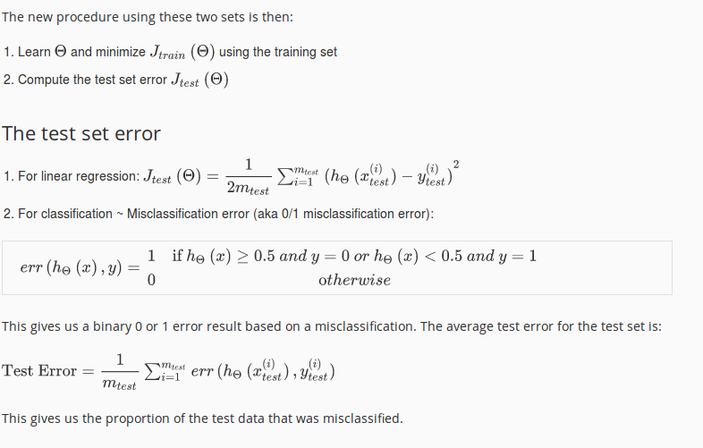
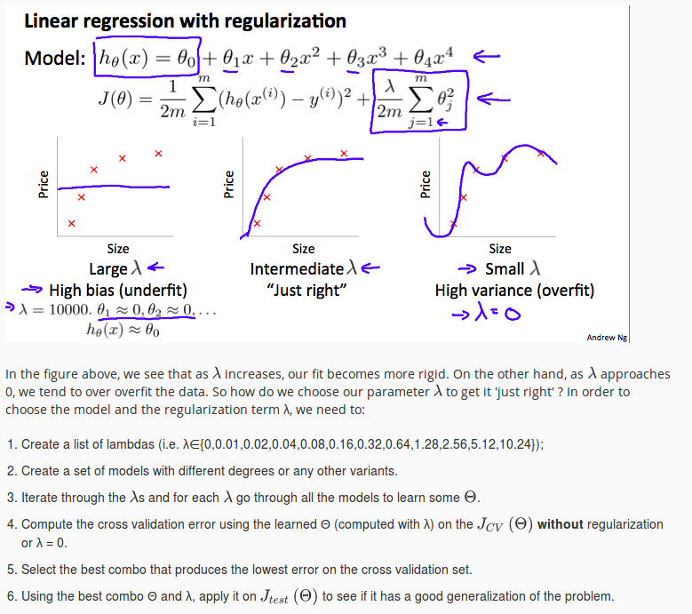

# Evaluating a Learing Akgorithm

Once we have done some trouble shooting for errors in our predictions by:

    * Getting more training examples
    * Trying smaller sets of features
    * Trying additional features
    * Trying polynomial features
    * Increasing or decreasing λ

We can move on to evaluate our new hypothesis.

A hypothesis may have a low error for the training examples but still be inaccurate (because of overfitting). Thus, to evaluate a hypothesis, given a dataset of training examples, we can split up the data into two sets: a training set and a test set. Typically, the training set consists of 70 % of your data and the test set is the remaining 30 %.

# Model Selection and Train/Validation/Test Sets

Just because a learning algorithm fits a training set well, that does not mean it is a good hypothesis. It could over fit and as a result your predictions on the test set would be poor. The error of your hypothesis as measured on the data set with which you trained the parameters will be lower than the error on any other data set.

Given many models with different polynomial degrees, we can use a systematic approach to identify the 'best' function. In order to choose the model of your hypothesis, you can test each degree of polynomial and look at the error result.

One way to break down our dataset into the three sets is:

  *  Training set: 60%
  *  Cross validation set: 20%
  *  Test set: 20%

We can now calculate three separate error values for the three different sets using the following method:

  1.  Optimize the parameters in Θ using the training set for each polynomial degree.
  1.  Find the polynomial degree d with the least error using the cross validation set.
  1.  Estimate the generalization error using the test set with JtestΘ<(d), (d = theta from polynomial with lower error);

This way, the degree of the polynomial d has not been trained using the test set.

# BIAS vs Variance

n this section we examine the relationship between the degree of the polynomial d and the underfitting or overfitting of our hypothesis.

  *  We need to distinguish whether bias or variance is the problem contributing to bad predictions.
  *  High bias is underfitting and high variance is overfitting. Ideally, we need to find a golden mean between these two.

The training error will tend to **decrease** as we increase the degree d of the polynomial.

At the same time, the cross validation error will tend to **decrease** as we increase d up to a point, and then it will increase as d is **increased**, forming a convex curve.
[bias-vs-variance](pics/evaluation/bias-vs-variance.png)

# Regularization and Bias/Variance

