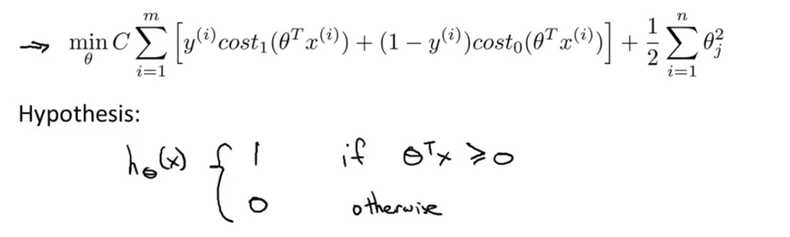

# Support Vector machines

The Support Vector Machine (SVM) is yet another type of supervised machine learning algorithm. It is sometimes cleaner and more powerful.

We will understand mathematical intuition of svm using Logistic Regression.

To make Support Vector Machine, we need to modify the cost function of Regularized Logistic Regression.

for values of z less than 1, we shall use a straight decreasing line instead of the sigmoid curve.(In the literature, this is called a hinge loss (https://en.wikipedia.org/wiki/Hinge_loss) function.)

for values of z greater than -1, we use a straight increasing line instead of the sigmoid curve.

We shall denote these as cost1(z) and cost0(z) (respectively, note that cost1(z) is the cost for classifying when y=1, and cost0(z) is the cost for classifying when y=0), and we may define them as follows (where k is an arbitrary constant defining the magnitude of the slope of the line)

We can optimize cost function a bit by multiplying by m (thus removing the m factor in the denominators). Note that this does not affect our optimization, since we're simply multiplying our cost function by a positive constant (for example, minimizing (u−5)2+1 gives us 5; multiplying it by 10 to make it 10(u−5)2+10 still gives us 5 when minimized).

Last equation is equivalent to multiplying the equation of Logistic Regression by C=1/λ, and thus results in the same values when optimized. Now, when we wish to regularize more (that is, reduce overfitting), we decrease C, and when we wish to regularize less (that is, reduce underfitting), we increase C.

Finally, note that the hypothesis of the Support Vector Machine is not interpreted as the probability of y being 1 or 0 (as it is for the hypothesis of logistic regression). Instead, it outputs either 1 or 0. (In technical terms, it is a discriminant function.)

### Large Magin Classifier
Sometime SVM is also called as Large magin Classifer.

Now when we set our constant C to a very large value (e.g. 100,000), our optimizing function will constrain Θ such that the equation A (the summation of the cost of each example) equals 0. We impose the following constraints on Θ:
* ΘTx ≥ 1 if y=1 and ΘTx ≤−1 if y=0.

If C is very large, we must choose Θ parameters such that it reduces our cost function to:

Recall the decision boundary from logistic regression (the line separating the positive and negative examples). In SVMs, the decision boundary has the special property that it is **as far away as possible** from both the positive and the negative examples.

The distance of the decision boundary to the nearest example is called the **margin**. Since SVMs maximize this margin, it is often called a Large Margin Classifier.

The SVM will separate the negative and positive examples by a large margin.

This large margin is only achieved when C is very large.

Data is linearly separable when a straight line can separate the positive and negative examples.

If we have outlier examples that we don't want to affect the decision boundary, then we can reduce C.

Increasing and decreasing C is similar to respectively decreasing and increasing λ, and can simplify our decision boundary.
